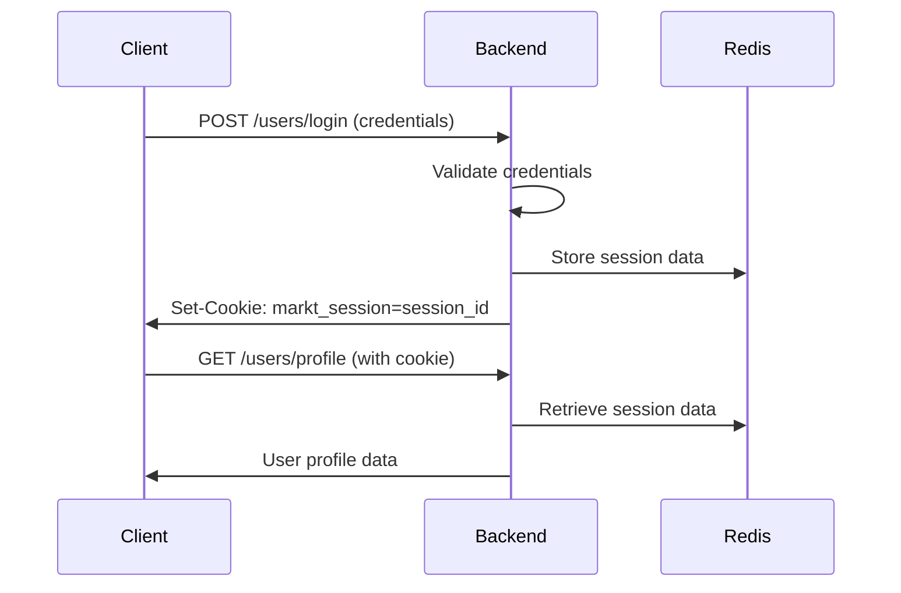

# Flask-Login Session Persistence Guide

## Overview

This document explains how Flask-Login session persistence works in the Markt API backend and how it differs from JWT-based authentication. Understanding this is crucial for implementing proper authentication in your React Native and Angular applications.

## Key Concepts

### Flask-Login vs JWT Authentication

| Aspect | Flask-Login | JWT |
|--------|-------------|-----|
| **Storage** | Server-side (Redis) | Client-side (localStorage/cookies) |
| **Token** | Session ID in cookie | JWT token in header |
| **Validation** | Server validates session | Client validates token |
| **Revocation** | Immediate (delete session) | Delayed (token expires) |
| **Security** | Server-controlled | Client-controlled |

### Session Flow



## Backend Configuration

### 1. Flask-Login Setup

```python
# main/setup.py
from flask_login import LoginManager

def configure_app(app):
    # Setup Flask-Login
    login_manager = LoginManager(app)
    login_manager.login_view = "users.UserLogin"
    
    # User loader function
    @login_manager.user_loader
    def load_user(user_id):
        return User.query.get(str(user_id))
```

### 2. Session Configuration

```python
# main/config.py
class Config:
    def __init__(self):
        # Session settings
        self.SECRET_KEY = config("SECRET_KEY", default="dev-secret-key")
        self.SESSION_COOKIE_NAME = "markt_session"
        self.SESSION_COOKIE_HTTPONLY = True
        self.SESSION_COOKIE_SECURE = False  # Set to True in production with HTTPS
        self.SESSION_COOKIE_SAMESITE = "Lax"
        self.PERMANENT_SESSION_LIFETIME = timedelta(days=7)  # 7 days
```

### 3. CORS Configuration

```python
# main/setup.py
from flask_cors import CORS

def configure_app(app):
    # CORS with credentials support
    CORS(app, supports_credentials=True, origins=["*"])
```

## Session Lifecycle

### 1. Login Process

```python
# app/users/routes.py
@bp.route("/login")
class UserLogin(MethodView):
    def post(self, credentials):
        try:
            user = AuthService.login_user(
                credentials["email"],
                credentials["password"],
                credentials.get("account_type"),
            )
            login_user(user)  # This creates the session
            return user
        except AuthError as e:
            abort(e.status_code, message=e.message)
```

**What happens during `login_user(user)`:**
1. Flask-Login generates a unique session ID
2. Session data is stored in Redis with the session ID as key
3. A cookie named `markt_session` is set with the session ID
4. Cookie is marked as `HttpOnly` and `Secure` (in production)

### 2. Session Validation

```python
# main/setup.py
@login_manager.user_loader
def load_user(user_id):
    return User.query.get(str(user_id))
```

**What happens on each request:**
1. Browser automatically sends the `markt_session` cookie
2. Flask-Login extracts the session ID from the cookie
3. Session data is retrieved from Redis using the session ID
4. User object is loaded using the `user_loader` function
5. `current_user` is available throughout the request

### 3. Logout Process

```python
# app/users/routes.py
@bp.route("/logout")
class UserLogout(MethodView):
    @login_required
    def post(self):
        logout_user()  # This destroys the session
        return None
```

**What happens during `logout_user()`:**
1. Session data is deleted from Redis
2. Cookie is cleared from the browser
3. User is no longer authenticated

## Redis Session Storage

### Session Data Structure

```python
# Example session data stored in Redis
{
    "session_id": "abc123def456",
    "user_id": "USR_123456789",
    "current_role": "buyer",
    "last_activity": "2024-01-15T10:30:00Z",
    "ip_address": "192.168.1.100",
    "user_agent": "Mozilla/5.0..."
}
```

### Session Expiration

```python
# Session expires after 7 days of inactivity
SESSION_EXPIRATION = 7 * 24 * 60 * 60  # 7 days in seconds
```

## Client-Side Implementation

### 1. Cookie Handling

**React Native (Axios):**
```javascript
const apiClient = axios.create({
  baseURL: 'https://your-api-domain.com/api/v1',
  withCredentials: true, // This is crucial for cookie handling
});
```

**Angular (HTTP Interceptor):**
```typescript
const authRequest = request.clone({
  withCredentials: true, // This is crucial for cookie handling
});
```

### 2. Session Persistence

**Local Storage Strategy:**
```javascript
// Store user data locally for quick access
const sessionData = {
  user: userData,
  timestamp: Date.now(),
};
localStorage.setItem('markt_user_session', JSON.stringify(sessionData));
```

**Session Validation:**
```javascript
// Check if local session is still valid
const isSessionValid = () => {
  const sessionData = localStorage.getItem('markt_user_session');
  if (!sessionData) return false;
  
  const { timestamp } = JSON.parse(sessionData);
  const now = Date.now();
  const sessionAge = now - timestamp;
  
  // Consider session expired after 7 days
  return sessionAge < 7 * 24 * 60 * 60 * 1000;
};
```

## Security Considerations

### 1. Cookie Security

```python
# Production settings
SESSION_COOKIE_SECURE = True      # Only over HTTPS
SESSION_COOKIE_HTTPONLY = True    # Not accessible via JavaScript
SESSION_COOKIE_SAMESITE = "Strict" # CSRF protection
```

### 2. Session Hijacking Prevention

```python
# Additional security measures
def validate_session(request):
    # Check IP address
    if session.get('ip_address') != request.remote_addr:
        logout_user()
        return False
    
    # Check user agent
    if session.get('user_agent') != request.headers.get('User-Agent'):
        logout_user()
        return False
    
    return True
```

### 3. Session Fixation Prevention

```python
# Regenerate session ID on login
def login_user(user, remember=False, force=False, fresh=True):
    if force or user.is_active:
        session['_fresh'] = fresh
        session['_id'] = _create_identifier()
        session['_user_id'] = str(user.get_id())
        session['_remember'] = remember
        session['_permanent'] = remember
        _request_ctx_stack.top.user = user
        return True
    return False
```

## Monitoring and Debugging

### 1. Session Monitoring

```python
# Log session activities
import logging
logger = logging.getLogger(__name__)

def log_session_activity(user_id, action):
    logger.info(f"Session {action} for user {user_id}")
```

### 2. Session Debugging

```python
# Debug session data
def debug_session():
    from flask import session
    print(f"Session ID: {session.get('_id')}")
    print(f"User ID: {session.get('_user_id')}")
    print(f"Fresh: {session.get('_fresh')}")
    print(f"Remember: {session.get('_remember')}")
```

### 3. Redis Session Inspection

```bash
# Connect to Redis
redis-cli

# List all session keys
KEYS "session:*"

# Get session data
GET "session:abc123def456"

# Set session expiration
EXPIRE "session:abc123def456" 604800  # 7 days
```

## Performance Optimization

### 1. Session Caching

```python
# Cache user data in session to reduce database queries
def load_user(user_id):
    # Check if user data is cached in session
    cached_user = session.get('_cached_user')
    if cached_user and cached_user['id'] == user_id:
        return cached_user
    
    # Load from database
    user = User.query.get(str(user_id))
    if user:
        # Cache user data
        session['_cached_user'] = {
            'id': user.id,
            'email': user.email,
            'username': user.username,
            'is_buyer': user.is_buyer,
            'is_seller': user.is_seller,
        }
    
    return user
```

### 2. Session Cleanup

```python
# Periodic cleanup of expired sessions
def cleanup_expired_sessions():
    import redis
    from datetime import datetime, timedelta
    
    redis_client = redis.Redis(host='localhost', port=6379, db=0)
    
    # Get all session keys
    session_keys = redis_client.keys("session:*")
    
    for key in session_keys:
        # Check if session is expired
        session_data = redis_client.get(key)
        if session_data:
            data = json.loads(session_data)
            last_activity = datetime.fromisoformat(data['last_activity'])
            
            if datetime.now() - last_activity > timedelta(days=7):
                redis_client.delete(key)
                logger.info(f"Cleaned up expired session: {key}")
```

## Troubleshooting

### Common Issues

1. **Sessions not persisting**
   - Check if `withCredentials: true` is set
   - Verify CORS configuration allows credentials
   - Check if cookies are being set in response headers

2. **Sessions expiring too quickly**
   - Check Redis configuration
   - Verify session expiration settings
   - Check if session data is being updated

3. **Multiple sessions for same user**
   - Check if session ID is being regenerated
   - Verify session cleanup is working
   - Check for session fixation attacks

### Debug Commands

```bash
# Check Redis connection
redis-cli ping

# Monitor Redis commands
redis-cli monitor

# Check session keys
redis-cli keys "session:*"

# Get session data
redis-cli get "session:abc123def456"

# Check session expiration
redis-cli ttl "session:abc123def456"
```

## Best Practices

### 1. Session Management
- Use secure cookies in production
- Implement session timeout
- Clean up expired sessions
- Monitor session activities

### 2. Security
- Use HTTPS in production
- Implement CSRF protection
- Validate session data
- Log security events

### 3. Performance
- Cache user data in sessions
- Use Redis for session storage
- Implement session cleanup
- Monitor session performance

### 4. Client-Side
- Handle session expiration gracefully
- Implement proper error handling
- Use local storage for quick access
- Validate sessions before sensitive operations

## Migration from JWT

If you're migrating from JWT to Flask-Login:

### 1. Remove JWT Logic
```javascript
// Remove JWT token handling
// localStorage.removeItem('jwt_token');
// delete axios.defaults.headers.common['Authorization'];
```

### 2. Add Cookie Support
```javascript
// Add cookie support
axios.defaults.withCredentials = true;
```

### 3. Update Error Handling
```javascript
// Update 401 error handling
if (error.response?.status === 401) {
  // Redirect to login (session expired)
  router.navigate('/login');
}
```

### 4. Update Session Validation
```javascript
// Replace JWT validation with session validation
const isAuthenticated = () => {
  return localStorage.getItem('markt_user_session') !== null;
};
```

This guide provides a comprehensive understanding of Flask-Login session persistence and how to implement it properly in your applications. The key advantage over JWT is that sessions are server-controlled, making them more secure and easier to manage.
